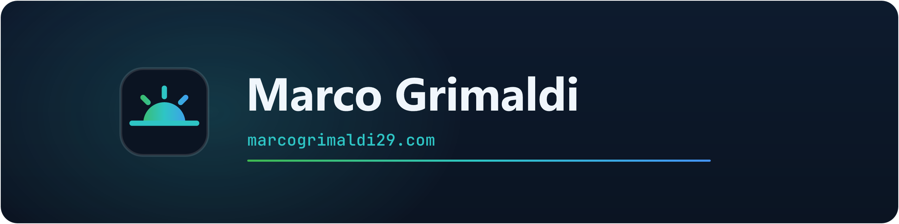

  

  
  
  

# 👋 Hey, I'm Marco Grimaldi

Technology enthusiast, language professional, and lifelong learner based in Spain.

I work at the intersection of **IT & Cloud**, **languages & training**, and **inclusive education** — combining problem-solving with collaboration and empathy to build tools and resources that help people learn and grow.

## 🛠️ What I Do

- **Cloud & Infrastructure** — Microsoft 365, Azure and Cloud Voice administration and architectures
- **Certification & Exam Prep** — Creating structured study materials for professional certifications
- **Languages & Training** — Foreign language teaching, academic support, and inclusive education for individuals and professionals

## 🌐 Personal Hub

My personal hub is available at **[marcogrimaldi29.com](https://marcogrimaldi29.com/)** — it serves as the central gateway to all my study notes, certification reviews, and published content. The latest certification reviews are published directly within the site/repo, while study notes have been built on their own dedicated GitHub repositories, which are listed below. Beyond certifications, the hub also features my blog, CV, and about page.

- **Source (GitHub Repo):** **[marcogrimaldi29.github.io](https://github.com/marcogrimaldi29/marcogrimaldi29.github.io)**

## 📚 Study Notes, Deep Dives & Resources

Most of my public repositories are open study notes for Microsoft and IT certifications:

| Repo | Topic |
|:-----------|:------|
| [az-104-study-notes](https://github.com/marcogrimaldi29/az-104-study-notes) | Azure Administrator Associate (AZ-104) — Study Notes |
| [az-305-bcdr](https://github.com/marcogrimaldi29/az-305-bcdr) | AZ-305: BCDR & Migrations — Deep Dive |
| [az-305-compute](https://github.com/marcogrimaldi29/az-305-compute) | AZ-305: Compute Services — Deep Dive |
| [az-305-data-analytics](https://github.com/marcogrimaldi29/az-305-data-analytics) | AZ-305: Data Storage Solutions — Deep Dive |
| [az-305-messaging](https://github.com/marcogrimaldi29/az-305-messaging) | AZ-305: Messaging & Event Services — Deep Dive |
| [az-305-study-notes](https://github.com/marcogrimaldi29/az-305-study-notes) | Azure Solutions Architect Expert (AZ-305) — Study Notes |
| [az-400-study-notes](https://github.com/marcogrimaldi29/az-400-study-notes) | Azure DevOps Engineer Expert (AZ-400) — Study Notes |
| [az-400-study-notes-v2](https://github.com/marcogrimaldi29/az-400-study-notes-v2) | Azure DevOps Engineer Expert (AZ-400) v2 — Study Notes |
| [az-500-study-notes](https://github.com/marcogrimaldi29/az-500-study-notes) | Azure Security Engineer Associate (AZ-500) — Study Notes |
| [dp-600-study-notes](https://github.com/marcogrimaldi29/dp-600-study-notes) | Fabric Analytics Engineer Associate (DP-600) — Study Notes |
| [dp-700-study-notes](https://github.com/marcogrimaldi29/dp-700-study-notes) | Fabric Data Engineer Associate (DP-700) — Study Notes |
| [dp-700-study-notes-v2](https://github.com/marcogrimaldi29/dp-700-study-notes-v2) | Fabric Data Engineer Associate (DP-700) v2 — Study Notes |
| [engage-center-notes](https://github.com/marcogrimaldi29/engage-center-notes) | Microsoft Engage Center — Deep Dive |
| [itil-4-foundation](https://github.com/marcogrimaldi29/itil-4-foundation) | ITIL® 4 Foundation — Study Notes |
| [ms-102-study-notes](https://github.com/marcogrimaldi29/ms-102-study-notes) | M365 Administrator Expert (MS-102) — Study Notes |
| [ms-700-study-notes](https://github.com/marcogrimaldi29/ms-700-study-notes) | Teams Administrator Associate (MS-700) — Study Notes |
| [ms-721-study-notes](https://github.com/marcogrimaldi29/ms-721-study-notes) | Collaboration Communications Systems Engineer Associate (MS-721) — Study Notes |
| [waf-cost-opt](https://github.com/marcogrimaldi29/waf-cost-opt) | Azure Well-Architected Framework: Cost Optimization — Deep Dive |

## 🤝 Let's Connect

- [![marcogrimaldi29.com](https://img.shields.io/badge/marcogrimaldi29.com-0b1422?style=flat-square&logo=data:image/svg%2Bxml;base64,PHN2ZyB4bWxucz0iaHR0cDovL3d3dy53My5vcmcvMjAwMC9zdmciIHZpZXdCb3g9IjAgMCAzMiAzMiIgd2lkdGg9IjMyIiBoZWlnaHQ9IjMyIj4KICA8ZGVmcz4KICAgIDxsaW5lYXJHcmFkaWVudCBpZD0iZyIgeDE9IjUiIHkxPSIxNiIgeDI9IjI3IiB5Mj0iMTYiIGdyYWRpZW50VW5pdHM9InVzZXJTcGFjZU9uVXNlIj4KICAgICAgPHN0b3Agb2Zmc2V0PSIwIiBzdG9wLWNvbG9yPSIjM2ZiOTUwIiAvPgogICAgICA8c3RvcCBvZmZzZXQ9IjAuNSIgc3RvcC1jb2xvcj0iIzJlYzVjNSIgLz4KICAgICAgPHN0b3Agb2Zmc2V0PSIxIiBzdG9wLWNvbG9yPSIjNDQ5M2Y4IiAvPgogICAgPC9saW5lYXJHcmFkaWVudD4KICA8L2RlZnM%2BCiAgPGcgc3Ryb2tlPSJ1cmwoI2cpIiBzdHJva2Utd2lkdGg9IjEuOSIgc3Ryb2tlLWxpbmVjYXA9InJvdW5kIj4KICAgIDxsaW5lIHgxPSIxNiIgeTE9IjEwLjUiIHgyPSIxNiIgeTI9IjcuNSIgLz4KICAgIDxsaW5lIHgxPSIxMC4yIiB5MT0iMTIuNiIgeDI9IjguNCIgeTI9IjEwLjgiIC8%2BCiAgICA8bGluZSB4MT0iMjEuOCIgeTE9IjEyLjYiIHgyPSIyMy42IiB5Mj0iMTAuOCIgLz4KICA8L2c%2BCiAgPHBhdGggZD0iTTguNSAyMCBhNy41IDcuNSAwIDAgMSAxNSAwIHoiIGZpbGw9InVybCgjZykiIC8%2BCiAgPGxpbmUgeDE9IjQuNSIgeTE9IjIwIiB4Mj0iMjcuNSIgeTI9IjIwIiBzdHJva2U9IiMyZWM1YzUiIHN0cm9rZS13aWR0aD0iMS45IiBzdHJva2UtbGluZWNhcD0icm91bmQiIC8%2BCjwvc3ZnPgo%3D&logoColor=white)](https://marcogrimaldi29.com/) — My central hub for study notes, certification reviews, and other resources
-  — You're already here; feel free to explore, star, or fork anything useful
-  — Let's connect, collaborate, or just say hello

If you find any of this content useful, consider giving the repo a ⭐ — it helps others discover it too. Feel free to reach out through my **[contact page](https://marcogrimaldi29.com/contact/)** and/or **[LinkedIn](https://www.linkedin.com/in/marco-grimaldi29/)** if you'd like to connect, collaborate, or just say hello.

---
