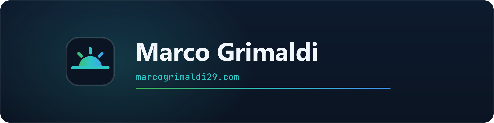

  

  
  
  

  

# 👋 Hey, I'm Marco Grimaldi

Cloud Architect & Consultant, Tech Enthusiast, and Lifelong Learner based in Spain.

I work at the intersection of **cloud architecture** and **knowledge sharing**, drawing on a background in sound engineering, language teaching and inclusive education — combining problem-solving with collaboration and empathy to build tools and resources that help people learn and grow.

## 🛠️ What I Do

- **Cloud Solution Architecture** — Advising clients on building resilient, cost-efficient, and well-governed environments, aligned with the Azure Well-Architected and Cloud Adoption Frameworks
- **Resiliency & Reliability** — Resiliency workshops, formal risk assessments, and Disaster Recovery, Business Continuity, and Major Incident Response Plans
- **Cost Optimization & Governance** — Cost Optimization, FinOps, and Governance workshops to help clients control cloud spend and stay compliant
- **Certification & Exam Prep** — Creating structured study materials for professional certifications

## 🌐 Personal Hub

My personal hub is available at **[marcogrimaldi29.com](https://marcogrimaldi29.com/)** — it serves as the central gateway to all my study notes, certification reviews, and published content. The latest certification reviews are published directly within the site/repo, while study notes have been built on their own dedicated GitHub repositories, which are listed below. Beyond certifications, the hub also features my projects, curated resources, CV, and about page.

## 📚 Study Notes, Deep Dives & Resources

Most of my public repositories are open study notes for Microsoft and IT-related certifications, alongside deep dives into topics that are core to my work:

| Repo | Topic |
|:-----------|:------|
| [ai-103-study-notes](https://github.com/marcogrimaldi29/ai-103-study-notes) | Azure AI Apps and Agents Developer Associate (AI-103) — Study Notes |
| [az-104-study-notes](https://github.com/marcogrimaldi29/az-104-study-notes) | Azure Administrator Associate (AZ-104) — Study Notes |
| [az-305-bcdr](https://github.com/marcogrimaldi29/az-305-bcdr) | AZ-305: BCDR & Migrations — Deep Dive |
| [az-305-compute](https://github.com/marcogrimaldi29/az-305-compute) | AZ-305: Compute Services — Deep Dive |
| [az-305-data-analytics](https://github.com/marcogrimaldi29/az-305-data-analytics) | AZ-305: Data Storage Solutions — Deep Dive |
| [az-305-messaging](https://github.com/marcogrimaldi29/az-305-messaging) | AZ-305: Messaging & Event Services — Deep Dive |
| [az-305-study-notes](https://github.com/marcogrimaldi29/az-305-study-notes) | Azure Solutions Architect Expert (AZ-305) — Study Notes |
| [az-400-study-notes](https://github.com/marcogrimaldi29/az-400-study-notes) | Azure DevOps Engineer Expert (AZ-400) — Study Notes |
| [az-400-study-notes-v2](https://github.com/marcogrimaldi29/az-400-study-notes-v2) | Azure DevOps Engineer Expert (AZ-400) v2 — Study Notes |
| [az-500-study-notes](https://github.com/marcogrimaldi29/az-500-study-notes) | Azure Security Engineer Associate (AZ-500) — Study Notes |
| [dp-600-study-notes](https://github.com/marcogrimaldi29/dp-600-study-notes) | Fabric Analytics Engineer Associate (DP-600) — Study Notes |
| [dp-700-study-notes](https://github.com/marcogrimaldi29/dp-700-study-notes) | Fabric Data Engineer Associate (DP-700) — Study Notes |
| [dp-700-study-notes-v2](https://github.com/marcogrimaldi29/dp-700-study-notes-v2) | Fabric Data Engineer Associate (DP-700) v2 — Study Notes |
| [engage-center-notes](https://github.com/marcogrimaldi29/engage-center-notes) | Microsoft Engage Center — Deep Dive |
| [gh-300-study-notes](https://github.com/marcogrimaldi29/gh-300-study-notes) | GitHub Copilot (GH-300) — Study Notes |
| [gh-600-study-notes](https://github.com/marcogrimaldi29/gh-600-study-notes) | Agentic AI Developer (GH-600) — Study Notes |
| [gh-900-study-notes](https://github.com/marcogrimaldi29/gh-900-study-notes) | GitHub Foundations (GH-900) — Study Notes |
| [itil-4-foundation](https://github.com/marcogrimaldi29/itil-4-foundation) | ITIL® 4 Foundation — Study Notes |
| [ms-102-study-notes](https://github.com/marcogrimaldi29/ms-102-study-notes) | M365 Administrator Expert (MS-102) — Study Notes |
| [ms-700-study-notes](https://github.com/marcogrimaldi29/ms-700-study-notes) | Teams Administrator Associate (MS-700) — Study Notes |
| [ms-721-study-notes](https://github.com/marcogrimaldi29/ms-721-study-notes) | Collaboration Communications Systems Engineer Associate (MS-721) — Study Notes |
| [sc-500-study-notes](https://github.com/marcogrimaldi29/sc-500-study-notes) | Cloud and AI Security Engineer Associate (SC-500) — Study Notes |
| [waf-cost-opt](https://github.com/marcogrimaldi29/waf-cost-opt) | Azure Well-Architected Framework: Cost Optimization — Deep Dive |

## 💚 Support

If any of these notes helped you, there are a few ways to show it: ⭐ star the repos you found useful so others can find them, 👤 follow my profile on GitHub to catch new notes, 🤝 connect with me on LinkedIn, or ☕ support the work behind them with a coffee.

  
  
  
  

Want to collaborate or just say hello? Reach out through my **[contact page](https://marcogrimaldi29.com/contact/)**.

---
